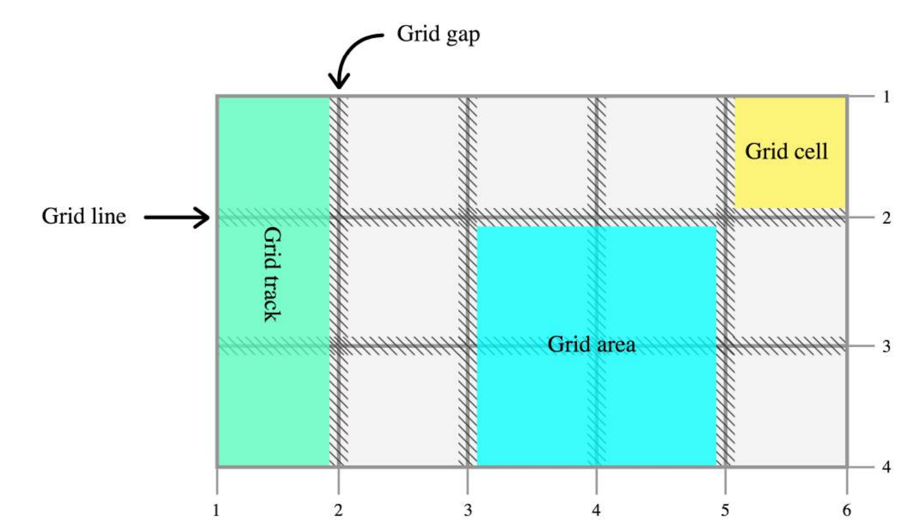

# CSS Grid

## 概述

CSS Grid（网格布局）是一种布局解决方案，通过网格来划分二维空间，以完成类似乐高积木那样的平面组合布局。

它与 Flexbox 布局的主要区别在于，它是二维布局，用于划分二维平面，适合整个页面的全局布局；Flexbox 是一维布局，是针对一根轴线的布局，主要用于一个组件的布局。

Grid 布局分成两个部分：首先定义网格，然后将元素放置在网格上。

它的基本做法是，先用`display: grid`指定容器使用网格布局，然后设置列（`grid-template-columns`）和行（`grid-template-rows`），最后指定子元素在网格里面的位置（`grid-column`和`grid-row`）。

## 基本概念

网格（grid）由一系列“单元格”（cell）组成。每个单元格由垂直的和水平的“格线”（grid line）划分出边界。一组垂直的网格，构成一“栏”（column）；一组水平的网格，构成一“排”（row）‘。

单元格与单元格之间有垂直或水平的间距（gutter）。



Grid 布局的基本元素是行（row）和列（column）。行与行之间、列与列之间存在间距（gutter）。行与列的交叉部分，就是一个单元格（cell）。多个单元可以组成一个区域（area）。

## 容器属性

### display 属性

`display: grid`就可以指定一个容器为网格布局。

```css
div {
  display: grid;
}
```

默认情况下，容器元素都是块级元素，但也可以设成行内元素。

```css
div {
  display: inline-grid;
}
```

上面代码指定`div`是一个行内元素，然后该元素内部是网格布局。

注意，设为网格布局以后，容器的`column`、`float`、`clear`、`vertical-align`这四个属性将失效。

### grid-template-columns 属性，grid-template-rows 属性

一个容器元素设置了`display: grid`以后，下一步就是要指定网格布局，即指定容器要分成多少行和多少列。`grid-template-columns`属性用来定义每一列的列宽，`grid-template-rows`属性则是定义每一行的行宽。

```css
.container {
  display: grid;
  grid-template-columns: 100px 100px 100px;
  grid-template-rows: 100px 100px 100px;
}
```

上面代码指定了一个三行乘以三列的网格。除了使用绝对单位，这里也允许使用百分比。

```css
.container {
  display: grid;
  grid-template-columns: 33.33% 33.33% 33.33%;
  grid-template-rows: 33.33% 33.33% 33.33%;
}
```

有时候，重复写同样的值非常麻烦，尤其是在网格很多的情况下。这时，可以使用`repeat()`函数，用于简化重复的值。

```css
.container {
  display: grid;
  grid-template-columns: repeat(3, 33.33%);
  grid-template-rows: repeat(3, 33.33%);
}
```

还有一种情况，单元格是绝对大小，但是容器的大小不确定。我们希望每一行或每一列，容纳尽可能多的单元格，这时可以使用`auto-fill`关键字表示自动填充。

```css
.container {
  display: grid;
  grid-template-columns: repeat(auto-fill, 100px);
}
```

上面代码表示每列宽度`100px`，然后自动填充，直到容器不能放置更多的列。

有时候，计算百分比不是很方便，这时可以使用`fr`关键字（fraction 的缩写），下面的代码可以取得一样的效果。

```css
.container {
  display: grid;
  grid-template-columns: 1fr 1fr 1fr;
  grid-template-rows: 1fr 1fr 1fr;
}
```

`fr`可以与绝对单位结合使用，这时会非常方便。

```css
.container {
  display: grid;
  grid-template-columns: 150px 1fr 2fr;
}
```

`grid-template-columns`属性和`grid-template-rows`属性都允许使用`auto`关键字，表示占据剩余的所有宽度。

```css
.container {
  display: grid;
  grid-template-columns: 100px auto 100px;
  grid-template-rows: 100px auto 100px;
}
```

有时候，希望为网格指定最小值或最大值，这时可以使用`minmax()`函数设置一个数值范围。

```css
.container {
  display: grid;
  grid-template-columns: 1fr 1fr minmax(160px, 1fr);
}
```

上面代码中，`minmax(160px, 1fr)`表示该列的列宽不小于`160px`，不大于`1fr`。

### 网格线的名字

`grid-template-columns`属性和`grid-template-rows`属性里面，还可以指定网格线的名字。

```css
.container {
  display: grid;
  grid-template-columns: [c1] 100px [c2] 100px [c3] auto [c4];
  grid-template-rows: [r1] 100px [r2] 100px [r3] auto [r4];
}
```

上面代码指定网格布局为三行乘三列，因此有四根竖线和四根横线。方括号里面依次是这八根线的名字。

### grid-row-gap 属性，grid-column-gap 属性，grid-gap 属性

`grid-row-gap`属性设置行与行的间隔（行间距），`grid-column-gap`属性设置列与列的间隔（列间距）。

```css
.container {
  display: grid;
  grid-template-columns: 100px 100px 100px;
  grid-template-rows: 100px 100px 100px;
  grid-row-gap: 20px;
  grid-column-gap: 20px;
}
```

上面代码中，`grid-row-gap`用于设置行间距，`grid-column-gap`用于设置列间距。如果两个值都相等，可以写成`grid-gap`。

`grid-gap`属性是`grid-column-gap`和`grid-row-gap`的简写形式。

```css
.container {
  display: grid;
  grid-gap: <grid-row-gap> <grid-column-gap>;
}
```

如果`grid-row-gap`和`grid-column-gap`的值相等，`grid-gap`可以只写一个值。

```css
.container {
  display: grid;
  grid-gap: 20px;
}
```

注意，`grid-`前缀将被删除，`grid-column-gap`和`grid-row-gap`也可以写为`column-gap`和`row-gap`，`grid-gap`也可以写为`gap`。

## 放置元素

定义网格布局以后，就可以把元素放置到网格上面。

```css
.grid {
  display: grid;
  grid-template-columns: 12em 1fr 15em;
  grid-template-rows: 10em 20em 1fr 10em;
  grid-template-areas: 'a a b'
                       'c d d'
                       'c d d'
                       'e e e';
}

.grid-item__a { grid-area: a; }
.grid-item__b { grid-area: b; }
.grid-item__c { grid-area: c; }
.grid-item__d { grid-area: d; }
.grid-item__e { grid-area: e; }
```

`grid-template-areas`属性用于为区域命名。如果多个区域同名，就表示它们合并成一个区域。

```css
.grid-1 {
  grid-template-areas:    "header header header"
                          "main main sidebar"
                          "footer footer footer";
}
```

容器元素的子元素会依次自动放入网格，这由`grid-auto-flow`属性决定。它的默认值是`row`，即网格编号的默认顺序，是先从左到右，再从上到下，即先行后列。也可以将它设成`column`，从先列后行。

```css
grid-auto-flow: column;
```

`grid-area`属性指定项目放在哪一个区域。

```css
.item-1 {
  background: #b03532;
  grid-area: header;
}
```

## 项目属性

### grid-column，grid-row

`grid-column`和`grid-row`用于指定项目占据第几行、第几列。

```css
.item-1 {
  background: #b03532;
  grid-column: 1;
  grid-row: 1;
}
```

上面代码中，项目`item-1`占据第一行第一列。

```csss
.item-1 {
  background: #b03532;
  grid-column: 1 / 3;
  grid-row: 1;
}
```

上面代码中，项目`item-1`占据第一行，从第一根列线到第三跟列线。

这两个属性之中，也可以使用`span`关键字，表示跨越多少个网格。

```css
.item-1 {
  background: #b03532;
  grid-column: 1 / 3;
  grid-row: 1 / 3;
}
/* 等同于 */
.item-1 {
  background: #b03532;
  grid-column: 1 / span 2;
  grid-row: 1 / span 2;
}
```

上面代码中，项目`item-1`占据的区域，包括第一行到第二行、第一列到第二列。

```css
.item-7 {
  background: #e03f3f;
  grid-column: span 2;
  grid-row: span 2;
}
```

上面代码中，项目`item-7`在原来的位置跨两行、跨两列。

`grid-column`和`grid-row`也可以指定网格的名字。

```css
.item {
  grid-column: foo;
}
```

上面代码中，`.item`的位置在名字叫做`foo`的那一列（column）。

注意，如果原来的位置放置不下该项目，容器会自动重新布局。

`dense`关键字表示紧密填充，尽量不出现空格。

```css
grid-auto-flow: row dense;
```

还可以指定网格线的名字。

```css
.grid-1 {
  display: grid;
  grid-template-columns: [start] 100px [centre-start] auto [last-column-start] 100px [finish];
  grid-template-rows: [header-start] 60px [main-start] 130px [main-end] 50px [row-end];
  grid-gap: 20px;
}
```

然后，指定项目起始的行线和列线。

```css
.item {
  grid-column: centre-start;
  grid-row: header-start;
}
```

可以为同一根线，指定多个名字`[main-end footer-start row-5]`。

每个区域的起始线和终止线，会有自动的名字。比如，区域名为`header`，则区域的起始行线和起始列线叫做`header-start`，终止行线和终止列线叫做`header-end`。

## 响应式实例

https://webdesign.tutsplus.com/tutorials/how-to-build-an-off-canvas-navigation-with-css-grid--cms-28191


## 参考链接

- https://webdesign.tutsplus.com/articles/new-course-3-css-grid-projects-for-web-designers--cms-27947

## grid-template-columns，grid-template-rows

`grid-template-columns`用来指定列宽，`grid-template-rows`用来指定行高。

```css
.container{
  grid-template-columns: 40px 50px auto 50px 40px;
  grid-template-rows: 25% 100px auto;
}
```

这两个属性之中，允许为每根网格线指定名称。

```css
.container{
  grid-template-columns: [first] 40px [line2] 50px [line3] auto [col4-start] 50px [five] 40px [end];
  grid-template-rows: [row1-start] 25% [row1-end] 100% [third-line] auto [last-line];
}
```

注意，网格线的名称可以相同，而且每根网格线可以有不止一个的名称。

```css
.container{
  grid-template-rows: [row1-start] 25% [row1-end row2-start] 25% [row2-end];
}
```

如果网格设置有重复，还可以使用`repeat`函数。

```css
grid-template-columns: repeat(3, 33.33%);
```

上面代码表示，重复`33.33%`三次。

## fr 单位

`fr`是一个表示比例关系的单位。

```css
grid-template-columns: 1fr 1fr 1fr;

grid-template-columns: 2fr 1fr 1fr;

grid-template-columns: 300px 1fr 3fr 20%;
```

`fr`会在剩余空间之中先减去`grid-gap`再进行[分配](https://twitter.com/jaffathecake/status/856884644704387072)，如果指定为百分比宽度，就没这个效果。

## grid-column-gap，grid-row-gap

`grid-column-gap`指定栏与栏的间距，`grid-row-gap`指定行与行的间距。`grid-gap`是这两个属性的简写。

```css
grid-gap: 20px;
```

`grid-column-gap`和`grid-row-gap`属性，用于指定网格线的尺寸。

```css
.container{
  grid-template: 100px 50px 100px / 80px auto 80px
  grid-column-gap: 10px;
  grid-row-gap: 15px;
}
```

`grid-gap`是`grid-column-gap`和`grid-row-gap`属性的简写形式。

```css
.container{
  grid-gap: <grid-column-gap> <grid-row-gap>;
}
```

## grid-column，grid-row

`grid-column`、`grid-row`用于指定网格在第几栏、第几行。

```css
.item-1 {
  grid-column: 1;
  grid-row: 1;
}

.item-2 {
  grid-column: 3;
  grid-row: 1;
}
```

这两个属性都可以指定起始位置和结束位置。

```css
.item-1 {
  background: #b03532;
  grid-column: 1 / 3;
  grid-row: 1;
}
```

也可以指定起始位置与跨栏/跨行的数量。

```css
.item-1 {
  background: #b03532;
  grid-column: 1 / span 2;
  grid-row: 1 / span 2;
}
```

或者，单独指定跨行和跨栏。

```css
.item-7 {
  background: #e03f3f;
  grid-column: span 2;
  grid-row: span 2;
}
```

## grid-template-areas

`grid-template-areas`属性用于在网格布局之中分配区域。

```css
.item-a{
  grid-area: header;
}
.item-b{
  grid-area: main;
}
.item-c{
  grid-area: sidebar;
}
.item-d{
  grid-area: footer;
}

.container{
  grid-template-columns: 50px 50px 50px 50px;
  grid-template-rows: auto;
  grid-template-areas: "header header header header"
                       "main main . sidebar"
                       "footer footer footer footer"
}
```

## grid-template

`grid-template`属性是`grid-template-columns`、`grid-template-rows`和`grid-template-areas`属性的简写形式。

```css
.container{
  grid-template: auto 50px auto /
                 [row1-start] 25px "header header header" [row1-end]
                 [row2-start] "footer footer footer" 25px [row2-end]; 
}
```

上面的写法等同于下面的写法。

```css
.container{
  grid-template-columns: auto 50px auto;
  grid-template-rows: [row1-start] 25px [row1-end row2-start] 25px [row2-end];
  grid-template-areas: "header header header"
                       "footer footer footer";
}
```

## justify-items

`justify-items`属性用来指定网格之中的内容如何水平对齐。

- start 左对齐
- end 右对齐
- center 居中对齐
- stretch 两端对齐（默认值）

```css
.container{
  justify-items: start;
}
```

`align-items`属性用来指定网格之中的内容如何垂直对齐。

- start 上端对齐
- end 下端对齐
- center 居中对齐
- stretch 两端对齐（默认值）

```css
.container{
  align-items: start;
}
```

`justify-content`属性用来指定网格数量小于容器提供的网格数量时，网格如何在水平排列。`align-content`属性用来指定网格数量小于容器提供的网格数量时，网格如何在垂直排列。

- start - aligns the grid to the left end of the grid container
- end - aligns the grid to the right end of the grid container
- center - aligns the grid in the center of the grid container
- stretch - resizes the grid items to allow the grid to fill the full width of the grid container
- space-around - places an even amount of space between each grid item, with half-sized spaces on the far ends
- space-between - places an even amount of space between each grid item, with no space at the far ends
- space-evenly - places an even amount of space between each grid item, including the far ends

```css
.container{
  justify-content: end;	
  align-content: start;	
}
```

## 项目属性

以下四个属性，通过指定网格线，决定一个网格区域的大小。

- grid-column-start
- grid-column-end
- grid-row-start
- grid-row-end

它有以下几个值。

- `<line>` - can be a number to refer to a numbered grid line, or a name to refer to a named grid line
- `span <number>` - the item will span across the provided number of grid tracks
- `span <name>` - the item will span across until it hits the next line with the provided name
- `auto` - indicates auto-placement, an automatic span, or a default span of one

例一。

```javascript
.item-a{
  grid-column-start: 2;
  grid-column-end: five;
  grid-row-start: row1-start
  grid-row-end: 3
}
```

例二。

```javascript
.item-b{
  grid-column-start: 1;
  grid-column-end: span col4-start;
  grid-row-start: 2
  grid-row-end: span 2
}
```

`grid-column`是`grid-column-start`和`grid-column-end`的简写形式；`grid-row`是`grid-row-start`和`grid-row-end`的简写形式。

```css
.item-c{
  grid-column: 3 / span 2;
  grid-row: third-line / 4;
}
```

`grid-area`用来给网格区域一个名称。

```css
.item-d{
  grid-area: header
}
```

`justify-self`属性用来指定内容在网格之内如何水平对齐，`align-self`属性指定如何垂直对齐。

- start - aligns the content to the left end of the grid area
- end - aligns the content to the right end of the grid area
- center - aligns the content in the center of the grid area
- stretch - fills the whole width of the grid area (this is the default)

```css
.item-a{
  justify-self: center;
}
```

## 两栏式布局

对于两栏式布局，Grid 的写法如下。

```css
.wrapper {
  display: grid;
  grid-template-columns: 70% 30%;
  grid-gap: 2rem;
}
```

## 函数

### minmax()

`minmax`函数定义列或宽的范围。

```css
.grid {
  display: grid;
  grid-template-columns: minmax(200px, 1fr) 300px 300px;
}
```

### repeat()

`repeat`函数定义列或宽的模式重复。

```css
.grid {
  display: grid;
  grid-template-columns: repeat(4, 75px 120px);
}
```

## 参考链接

- [A Complete Guide to Grid](https://css-tricks.com/snippets/css/complete-guide-grid/), by Chris House
- [Understanding the CSS Grid Layout Module](https://webdesign.tutsplus.com/series/understanding-the-css-grid-layout-module--cms-1079), by Ian Yates
